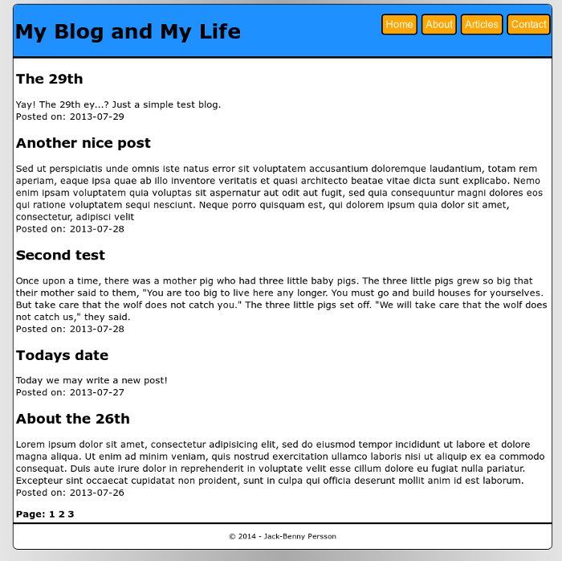

simplog
=======

simplog is a simple PHP blog engine. It's supposed to either be implemented into
an existing webpage (simplog.php) since this in only the engine part or being
run as is with the included index.php which is a simple webpage easy to 
customize.

Usage
-----
simplog.php is intended to be included (with php include) on your webpage, 
therefore simplog.php doesn't include any HTML start/end tags or anything 
like that. That's for your webpage to handle, simplog is made as clean as 
possible for this reason. The includes and user directory also needs to be on 
your server in the same directory, they include important files. In the user 
directory you can create new posts and edit existing ones. To edit a post click
on Edit post (in /user) and fill in the date and title of the post you want to 
edit. Hit Find post to find the post or posts matching. Now you can edit the 
post.

From 2014-06-26 there is a index.php file included with a simple yet fancy
webpage one can use for everyday blogging. It's simple to customize since all of
the design, colors etc resides in a single CSS file.

How do I create the MySQL table?
--------------------------------

Either create a new mysql user and database or use an existing one, then:

Go to http://mydomain.tld/path-to-simplog/install.php

On this page you enter a password for the admin user. The admin user is unique
in the MySQL table so once you've entered a password for the user you cannot
run it again. But to really be on the safe side you should remove install.php
after you have entered a password for admin.
Once you have entered your desired password you have created the table for the 
blog and can start filling it with blog posts.

Screenshot
----------

Contributing
------------
Any contributions are welcome since this is a work in progress.
Add yourself to the THANKS file if you like to after contributing to the 
project.

